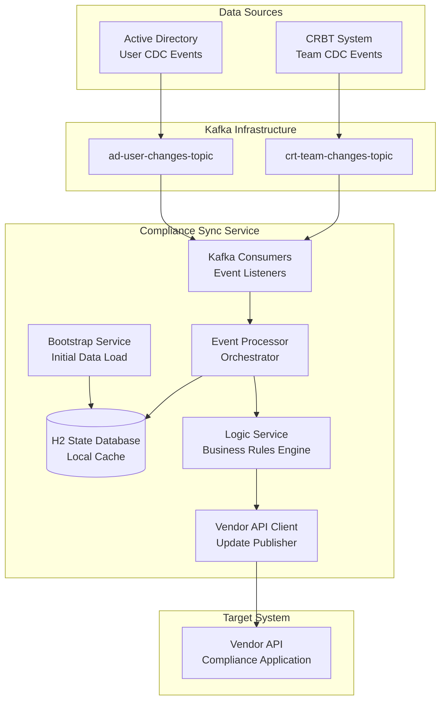

# Compliance Synchronization Service (real-time-service)

## 1. Overview

The **Compliance Synchronization Service** is a real-time, event-driven Java microservice responsible for keeping a third-party vendor's compliance application in sync with Edward Jones's internal user and team data.

This service replaces a legacy set of procedural PowerShell scripts, re-engineering the process into a modern, robust, and stateful architecture. It listens to live Change Data Capture (CDC) events from Active Directory (AD) and the internal CRBT (Compliance, Risk, and Business Technology) team management system, applies complex business logic to determine the correct user configurations, and pushes targeted updates to the vendor's API.

### Key Responsibilities

- **Listen** for user and team change events from Kafka topics
- **Maintain** an internal, persistent state of the user and team hierarchy  
- **Calculate** the correct Groups and Visibility Profiles for users based on complex translated business rules
- **Push** real-time updates to the vendor's API
- **Reconcile** any configuration drift with a nightly "true-up" job

### Technology Stack

- **Language:** Java 21
- **Framework:** Spring Boot 3.x / Spring Framework 6.x
- **Data Persistence:** H2 File-Based Database (for persistent state)
- **Messaging:** Apache Kafka
- **Build Tool:** Gradle (Groovy DSL)

## 2. Architecture Design

The service is built on a modern, event-driven microservice architecture with a strong emphasis on separation of concerns. The core architectural pattern is a **stateful event processor**.

### 2.1. High-Level Data Flow



#### Data Sources

- **Active Directory:** The source of truth for all user attributes (name, title, manager, location). Changes are published as CDC events to the `ad-user-changes` Kafka topic.
- **CRBT System:** The source of truth for Financial Advisor team structures (SFA, HTM, VTM). Changes are published as CDC events to the `crt-team-changes` Kafka topic.

#### Compliance Sync Service (This Project)

- **Bootstrap:** On startup, the service performs a full data load from AD and CRBT to build an initial, complete snapshot of the world.
- **State Database (H2):** This snapshot is stored locally in a persistent H2 file-based database. This database acts as the service's "memory" or "local cache," preventing the need to query the source systems for every event.
- **Kafka Consumers:** The service continuously listens to both Kafka topics for incoming change events.
- **Event Processor & Logic Engine:** When an event arrives, the service updates its local H2 state and then triggers a logic engine to calculate the impact of the change.
- **Vendor API Client:** The service pushes the calculated updates (for users, groups, and visibility profiles) to the vendor's API.

#### Data Target

- **Vendor API:** The third-party compliance application, which receives the final, calculated configurations.

### 2.2. The Three Operational Modes

The service is designed with three distinct modes of operation to ensure both real-time speed and long-term data integrity:

1. **Bootstrap Service:** Runs once on application startup. Its sole purpose is to create a fresh, accurate snapshot of all users and teams in the local H2 state database.

2. **Real-Time Service:** Runs continuously. This is the core of the application, listening to Kafka and processing events as they arrive in milliseconds.

3. **Reconciliation Service:** Runs on a nightly schedule (e.g., 2 AM). This is a safety net that corrects any "state drift" that may have occurred due to manual UI changes in the vendor application or missed Kafka events.

## 3. Component-Level Design

The project is organized into a clean, multi-layered package structure that enforces separation of concerns.

### 3.1. Package Structure

```
com.edwardjones.cre
├── config/                 // Spring and Kafka configuration beans
├── model/
│   ├── domain/            // JPA Entities - The H2 database schema
│   └── dto/               // Data Transfer Objects for Kafka messages and API payloads
├── repository/            // Spring Data JPA interfaces for database access
├── client/                // API clients for external systems (AD, CRBT, Vendor)
└── service/
    ├── bootstrap/         // Logic for the initial data load
    ├── logic/             // << THE CENTRAL BRAIN >> Business rule translation
    ├── realtime/          // Kafka listeners and event orchestration
    └── reconciliation/    // The nightly true-up job
```

### 3.2. Key Components (Under the Hood)

#### `service/bootstrap/BootstrapService`

- Triggered once by the `@PostConstruct` annotation on application startup
- Calls the `AdLdapClient` and `CrbtApiClient` to fetch all data
- **Crucial Logic:** Implements a two-stage persistence for users to handle the self-referencing manager relationship, preventing foreign key constraint violations:
  1. Saves all users with `managerUsername` set to `null`
  2. Updates all users with the correct `managerUsername` after all primary keys exist

#### `service/realtime/ChangeEventProcessor` (The Orchestrator)

This class is a lean orchestrator, not a business logic engine. It is called directly by the `ComplianceKafkaListener`.

**Responsibilities:**
- Receive a DTO (e.g., `AdChangeEvent`)
- Update the corresponding entity in the H2 database (e.g., `AppUser`)
- Determine the "blast radius" or scope of impact. For a simple user change, this is just the user. For a leader's title change, this includes the leader and all their direct reports (queried via the `directReports` relationship in the `AppUser` entity)
- Delegate the list of affected users to the `ComplianceLogicService` for processing

#### `service/logic/ComplianceLogicService` (The Brain)

This is the **single source of truth** for all business rules. It contains the complete Java translation of the logic from the original PowerShell scripts.

It is stateless; it reads the current state from the repositories, performs calculations, and returns the result.

**Key Methods:**
- `recalculateAndPushUpdates(Set<AppUser> users)`: The main public entry point. It iterates through a set of affected users
- `calculateConfigurationForUser(AppUser user)`: The core private method that orchestrates the business logic for a single user
- `determineUserType(AppUser user)`: Translates the PowerShell `get-userType` function
- `generateLeaderProfile(AppUser leader, ...)`: Translates the `config-Leader` logic
- `generateConfigurationFromMultipleGroups(...)`: Translates the `get-visibilityProfileFromGroups` logic, correctly handling the VTM > HTM > SFA precedence

#### `model/domain/AppUser.java` (The Hybrid Relationship)

This entity uses a powerful **hybrid model** for the manager relationship to achieve both efficient writes and reads:

```java
// Efficient writes - target for direct updates from Kafka event handlers
private String managerUsername;

// Rich reads - for clean, type-safe traversal by ComplianceLogicService  
@ManyToOne(fetch = FetchType.LAZY)
@JoinColumn(name = "manager_username", referencedColumnName = "username", 
            insertable = false, updatable = false)
private AppUser manager;

@OneToMany(mappedBy = "manager", fetch = FetchType.LAZY)
private Set<AppUser> directReports = new HashSet<>();
```

## 4. Configuration and Deployment

### 4.1. Application Properties

The service is configured via `application.yml`:

```yaml
spring:
  application:
    name: compliance-sync-service
  datasource:
    url: jdbc:h2:file:./data/compliance_state_db;AUTO_SERVER=TRUE
    driverClassName: org.h2.Driver
  kafka:
    bootstrap-servers: localhost:9092
    consumer:
      group-id: compliance-sync-group
      auto-offset-reset: earliest

app:
  kafka:
    topics:
      ad-changes: ad-user-changes-topic
      crt-changes: crt-team-changes-topic
      dlt: compliance-sync.dlt
  reconciliation:
    cron: "0 0 2 * * ?" # 2 AM every day
```

For tests, configuration is automatically overridden by `application-test.yml` when running with the "test" profile.

### 4.2. Build and Run

#### Prerequisites
- Java 21 or higher
- Gradle 8.x
- Access to Kafka brokers
- Network connectivity to AD LDAP and CRBT API endpoints

#### Build
```bash
./gradlew build
```

#### Run
```bash
./gradlew bootRun
```

#### Test
```bash
./gradlew test
```

## 5. Testing Strategy

The project uses a comprehensive testing approach:

### 5.1. Integration Tests
- **Framework:** `@SpringBootTest` with in-memory H2 database (`jdbc:h2:mem:test_db`)
- **Isolation:** Kafka listeners are mocked via `@MockitoBean`
- **Benefits:** Tests are fast, completely offline, and test the full integration of application components without external infrastructure dependencies

### 5.2. Business Logic Tests
- **ComplianceLogicServiceTest:** Comprehensive test suite that verifies all core business logic scenarios:
  - Simple Branch Users (BR)
  - Simple Home Office Users (HO)  
  - Home Office Leaders (HO_LEADER)
  - Branch Leaders with Teams (BR_TEAM)
  - Multi-team Members (precedence logic)
  - Hybrid Users (HOBR)
  - Error handling scenarios
  - Country-specific logic (US vs CAN)

### 5.3. Test Data
- **Consistent Setup:** `TestDataInitializer` ensures each test starts with fresh, known data
- **Mock Sources:** Tests use realistic mock data from JSON files in `test-data/`

## 6. Error Handling and Resilience

### 6.1. Kafka Error Handling
The `ComplianceKafkaListener` uses Spring Kafka's `@RetryableTopic` annotation for robust error handling:

- **Retry Logic:** Failed events are retried 3 times with exponential backoff
- **Dead Letter Topic:** Persistently failing messages are moved to a DLT for manual inspection
- **Non-blocking:** Single bad messages don't block the entire topic processing

### 6.2. Data Integrity
- **Bootstrap Validation:** The bootstrap process includes warnings for data mismatches (e.g., team members who don't exist in AD)
- **Foreign Key Safety:** Two-stage persistence prevents constraint violations
- **Reconciliation Safety Net:** Nightly reconciliation corrects any configuration drift

## 7. Operational Considerations

### 7.1. State Management
- **Persistence:** Uses file-based H2 database stored at `./data/compliance_state_db.mv.db`
- **Resilience:** Service state survives restarts
- **Scaling:** For horizontal scaling, replace with external database (PostgreSQL recommended)

### 7.2. Monitoring and Observability
- **Logging:** Structured logging with different levels for different operational modes
- **Health Checks:** Spring Boot Actuator endpoints for monitoring
- **Metrics:** Built-in metrics for Kafka consumers and database operations

### 7.3. Data Quality
- **Source Validation:** Bootstrap process validates data consistency between AD and CRBT
- **Warning Logs:** Highlights potential data quality issues in source systems
- **Graceful Degradation:** Continues processing valid data even when some records have issues

## 8. Development Guidelines

### 8.1. Code Organization Principles
- **Single Responsibility:** Each service class has one clear purpose
- **Dependency Injection:** All components use constructor injection
- **Immutable DTOs:** Use records for data transfer objects where possible
- **Transaction Management:** Use `@Transactional` appropriately for data consistency

### 8.2. Business Logic Changes
- **Central Location:** All business rule changes go through `ComplianceLogicService`
- **Test Coverage:** Every business rule change must include corresponding test cases
- **Documentation:** Complex logic includes JavaDoc explaining the original PowerShell equivalent

### 8.3. Adding New Event Types
1. Create DTO in `model/dto/`
2. Add processing logic in `ChangeEventProcessor`
3. Update `ComplianceLogicService` if business rules are affected
4. Add comprehensive test coverage

## 9. Troubleshooting

### 9.1. Common Issues

#### Application Won't Start
- **Check:** H2 database file permissions
- **Check:** Kafka broker connectivity
- **Check:** Port 8080 availability

#### Missing Users/Teams
- **Check:** Bootstrap process logs for warnings
- **Check:** Source system connectivity (AD LDAP, CRBT API)
- **Verify:** Data consistency between sources

#### Event Processing Failures
- **Check:** Dead Letter Topic for failed messages
- **Review:** Application logs for specific error details
- **Verify:** Event payload format matches expected DTOs

### 9.2. Log Analysis
Key log patterns to monitor:
- `Bootstrap: Saved X users and Y teams` - Successful startup
- `Processing X users` - Real-time event processing
- `ERROR` - Any errors require investigation
- `WARN User X not found` - Data quality issues

## 10. Contributing

### 10.1. Development Setup
1. Clone the repository
2. Ensure Java 21+ is installed
3. Run `./gradlew build` to verify setup
4. Run `./gradlew test` to verify all tests pass

### 10.2. Code Standards
- Follow existing package structure
- Maintain test coverage above 80%
- Use meaningful variable and method names
- Include JavaDoc for public APIs

### 10.3. Pull Request Process
1. Create feature branch from `main`
2. Implement changes with tests
3. Verify all tests pass: `./gradlew test`
4. Submit PR with detailed description
5. Address code review feedback

---

**For additional support or questions, contact the Edward Jones Compliance Technology team.**
